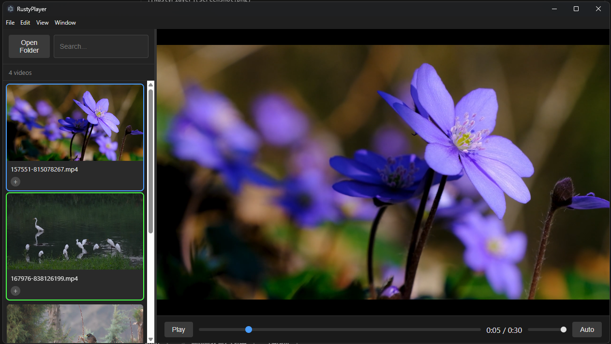

# RustyPlayer

A lightweight video player with a thumbnail gallery for easy browsing and playback.



## Features

- **Thumbnail Gallery** — Browse videos as visual thumbnails in a scrollable grid
- **Auto-Advance** — Videos auto-play continuously (TikTok-style flow)
- **Keyboard Navigation** — Control playback without leaving the keyboard
  - `↑` / `↓` — Previous / Next video
  - `←` / `→` — Seek backward / forward 10 seconds
  - `Space` — Play / Pause
  - `Escape` — Focus search
- **Tagging** — Add custom tags to videos for organization
- **Search** — Filter videos by name or tag
- **Resizable Panel** — Drag to resize the sidebar
- **Dark Theme** — Easy on the eyes

## Supported Formats

MP4, WebM, MOV

## Getting Started

### Prerequisites

- [Node.js](https://nodejs.org/) (v18+)
- [npm](https://npmjs.com/)

### Installation

```bash
# Clone the repository
git clone https://github.com/yourusername/rustyplayer.git
cd rustyplayer

# Install dependencies
npm install
```

### Running

```bash
# Development mode
npm run dev

# Build for production
npm run build
```

## Usage

1. Click **Open Folder** to select a video directory
2. Click a thumbnail to start playing
3. Use keyboard shortcuts to navigate

## Tech Stack

- [Electron](https://www.electronjs.org/) — Desktop framework
- HTML5 Video — Media playback

## Contributing

Contributions welcome! Feel free to open issues and pull requests.

## License

[MIT](LICENSE) — See LICENSE file.